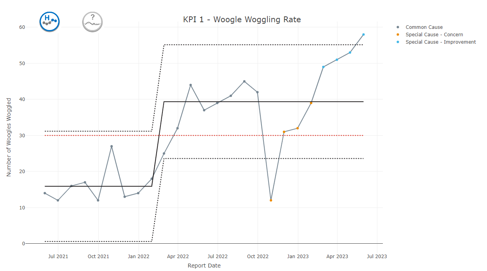
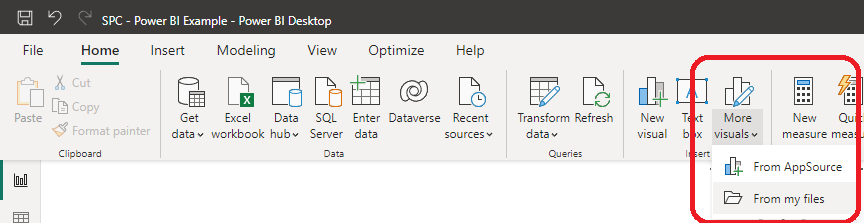
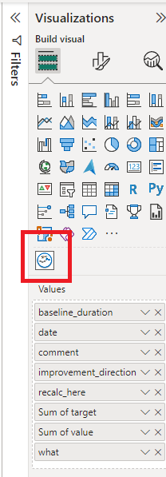
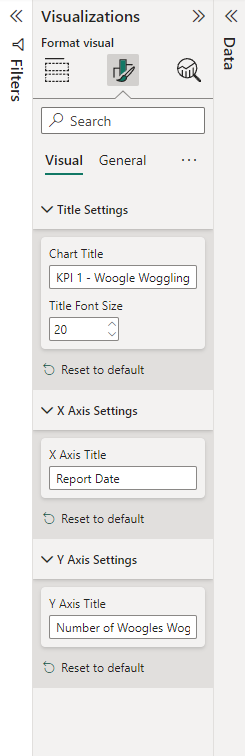

<!-- README.md is generated from README.Rmd. Please edit that file -->

# NHSRplotthedots - a PowerBI Custom Visual Implementation (with many thanks to NHS-R) 

This is a custom visual for PowerBI to allow the generation of
statistical process control (SPC) charts.

All calculations feeding into the visual are powered by R code written
by package is built by the [NHS-R community](https://nhsrcommunity.com)
in the NHSRplotthedots package.

This visual, like the R package, supports the NHSE/I programme [‘Making
Data Count’](https://www.england.nhs.uk/publication/making-data-count/),
and allows users to draw XmR charts, use change points, and apply rules
with summary indicators for when rules are breached.

Please see [‘Making Data Count’
programme](https://www.england.nhs.uk/publication/making-data-count/)
for more details about the precise flavour of XmR used.

> The programme encourages boards, managers, and analyst teams to
> present data in ways that show change over time, and drive better
> understanding of indicators than ‘RAG’ (red, amber, green) rated board
> reports often present.

-   NHS R plot the dots

# NHS-R links

# Using the PowerBI custom visual

The PowerBI visual itself can be downloaded from the **dist/** folder.
Save the .pbix file in there to any location on your computer.

The PowerBI custom visual can then be imported into PowerBI using the
option ‘more visuals’ –&gt; ‘From my files’.

At present, the input format is very restrictive and expects **all** of
the following headers, though some columns may be left blank:

| what                                                                                              | improvement\_direction                                                                                                                                                               | date                          | value         | recalc\_here                                                                                                           | comment                                                                                      | baseline\_duration                                                                                                                                                  | target                                                                                                                  |
|---------------------------------------------------------------------------------------------------|--------------------------------------------------------------------------------------------------------------------------------------------------------------------------------------|-------------------------------|---------------|------------------------------------------------------------------------------------------------------------------------|----------------------------------------------------------------------------------------------|---------------------------------------------------------------------------------------------------------------------------------------------------------------------|-------------------------------------------------------------------------------------------------------------------------|
| *Identifier for the data. Not currently used but in future may be used to set the default title.* | **increase** or **decrease** are the only accepted options here at present - ‘neutral’ to be added at a later date. Must be the same for the whole dataset but include in every row. | Date in the format yyyy-mm-dd | numeric value | MAY BE BLANK. Any of ‘y’, ‘Y’, ‘yes’, ‘Yes’ or ‘YES’ will make the package recalculate the process limits at this row. | MAY BE BLANK. Not currently used, but in future will be used to add annotations to the plot. | MAY BE BLANK. Sets the number of points that will be used to calculate the baseline. If included, must be the same for the whole dataset and included in every row. | MAY BE BLANK. Set a target for the plot. If included, must be the same for the whole dataset and included in every row. |
| KPI-309 Number of Clients Seen in Month                                                           | increase                                                                                                                                                                             | 2021-05-31                    | 14            | y                                                                                                                      | Remodelled system                                                                            | 15                                                                                                                                                                  | 30                                                                                                                      |

Example datasets are given in **sample\_datasets/**

A csv template is given in **template\_dataset/**

An example PowerBI file is available in **pbi\_example\_file/**

The visual should appear in your list of available visuals. Click on the
icon to add a blank visual to the page. With the visual selected, drag
all fields from your dataset into your ‘values’ section.

At this stage, if you have more than one KPI in your dataset, you should
filter the dataset down to a single KPI using the built-in power BI
filters or a slicer to allow users to filter the KPI themselves.

The plot title and size, y axis title and x axis title can be set using
the ‘visual’ options. These changes will all be rendered using plotly.

Some additional options are available from PowerBI by clicking on
‘general’ within this menu. Depending on your version of PowerBI this
will allow you to add extra titles, subtitles, a heading colour and an
outline.

# Information for Collaborators

## Key parts of the custom PowerBI visual

| File                     | Function                                                                                                                                                                                                   |
|--------------------------|------------------------------------------------------------------------------------------------------------------------------------------------------------------------------------------------------------|
| script.r                 | The main R script that ingests the data then creates and saves the plotly visual. Additional settings specified in settings.ts and capabilities.json will need to be referenced in here to have an effect. |
| pbiviz.json              | Version numbers are updated in here.                                                                                                                                                                       |
| capabilities.json        | Used when adding additional options to the PowerBI visualisation customisation panel                                                                                                                       |
| src/settings.ts          | Used when adding additional options to the PowerBI visualisation customisation panel                                                                                                                       |
| r\_files/flatten\_HTML.r | Helper functions generated automatically by PBI viz tools when using the RHTML template. References by script.r                                                                                            |

## Setting up development environment to build from source

A full tutorial will be written up at a later date.

In the meantime, details on setting up the required packages were
obtained from the following tutorials:

<https://medium.com/@thakurshalabh/create-dynamic-custom-visual-in-power-bi-using-r-ggplot2-and-plotly-4b15a73ef506>

It’s important to note that (as of June 2023) there is an error with the
most recent version of `powerbi-visuals-tools` has a bug that means that
compiled visuals will just render as blank.

Instead, when you reach this step in the tutorial, use the following to
get the most recent working version:

    npm i -g powerbi-visuals-tools@4.0.5

The following page should be consulted to see which versions of R
packages are currently suppported on the PowerBI service.
<https://learn.microsoft.com/en-us/power-bi/connect-data/service-r-packages-support>

## How to tweak the plotly implementation

The file `script.R` is the key file for All underlying files use the

## How to add additional PowerBI visual formatting options

A full tutorial will follow, but for now this excellent and in-depth
tutorial from Stéphane Laurent will get you started:
<https://laustep.github.io/stlahblog/posts/pbiviz.html#adding-formatting-objects>

# 
