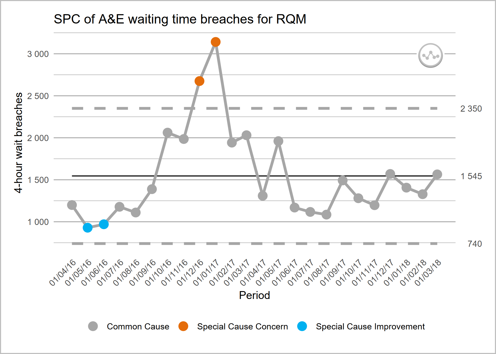

<!-- README.md is generated from README.Rmd. Please edit that file -->

# NHSRplotthedots

<!-- badges: start -->

<!-- badges: end -->

This package is built by the [NHS-R
community](https://nhsrcommunity.com) to provide tools for drawing
statistical process control (SPC) charts. This package supports NHS
England’s [‘Making Data
Count’](https://www.england.nhs.uk/publication/making-data-count/)
programme, and allows users to draw XmR charts, use change points, and
apply rules with summary indicators for when rules are breached.

Please be aware that this package is in the early stages of development,
and features may change.

## Installation

    # install from CRAN
    install.packages("NHSRplotthedots")

    # Or install the development version from GitHub using {remotes} package:
    # install.packages("remotes")
    remotes::install_github("https://github.com/nhs-r-community/NHSRplotthedots", 
    build_vignettes = TRUE)

## Tip!

If any charts that you are creating don’t have the variation flags in
the top right and instead are a `c` this is possibly because you need
the development version of `NHSRplotthedots` which is version
v0.1.0.9000.

Reinstalling over a later version won’t work and you will first need to
uninstall the package using code `remove.packages("NHSRplotthedots")`.

# Overview

Welcome to the NHS-R community’s package for building a specific type of
statistical process control (SPC) chart, the XmR chart. We are aiming to
support NHS England’s [‘Making Data
Count’](https://www.england.nhs.uk/publication/making-data-count/)
programme. The programme encourages boards, managers, and analyst teams
to present data in ways that show change over time and drive better
understanding of indicators than ‘RAG’ (red, amber, green) rated board
reports often present.

The help files and vignettes within this package tell you more about the
possible options for controlling the charts, but below are some simple
examples of the type of chart the package produces. We will use the
`ae_attendances` dataset from the `NHSRdatasets` package and a bit of
`dplyr` code to select some organisations.

    library(NHSRplotthedots)
    library(NHSRdatasets)
    library(dplyr)

    sub_set <- ae_attendances |>
      filter(org_code == "RQM", type == 1, period < as.Date("2018-04-01"))

    sub_set |>
      ptd_spc(
        value_field = breaches,
        date_field = period,
        improvement_direction = "decrease"
      )

This plot is ok on its own, but we can specify more control options if
we explicitly pass it on to the `plot()` function

    sub_set |>
      ptd_spc(
        value_field = breaches,
        date_field = period,
        improvement_direction = "decrease"
      ) |>
      plot(
        y_axis_label = "4-hour wait breaches",
        main_title = "SPC of A&E waiting time breaches for RQM"
      )

or, equivalently:

    sub_set |>
      ptd_spc(
        value_field = breaches,
        date_field = period,
        improvement_direction = "decrease"
      ) |>
      ptd_create_ggplot(
        y_axis_label = "4-hour wait breaches",
        main_title = "SPC of A&E waiting time breaches for RQM"
      )

You can also use the `summary()` function to get some basic statistics
about your SPC data frame. The function prints the SPC options, and then
returns the summarised results as a table:

    summary_df <- sub_set |>
      ptd_spc(
        value_field = breaches,
        date_field = period,
        improvement_direction = "decrease",
        target = 1200
      ) |>
      summary()
    #> Plot the Dots SPC options:
    #> ================================
    #> value_field:          'breaches'
    #> date_field:           'period'
    #> facet_field:          not set
    #> rebase:               not set
    #> fix_after_n_points:   not set
    #> improvement_direction:'decrease'
    #> target:               '1200'
    #> trajectory:           not set
    #> screen_outliers:      'TRUE'
    #> --------------------------------

You could assign this summary table to a variable and use it later:

    # base R -----------------
    summary_df$variation_type
    #> [1] "common_cause"
    summary_df$assurance_type
    #> [1] "inconsistent"

    # tidyverse -----------------
    summary_df |>
      select(variation_type) |>
      pull()
    #> [1] "common_cause"

    summary_df |>
      select(assurance_type) |>
      pull()
    #> [1] "inconsistent"

### Interactive plots with Plotly

It’s also possible to generate interactive plots using the `plotly`
package by replacing the call to `plot` with `ptd_create_plotly()`. This
function takes the same arguments as `plot`/`ptd_create_ggplot()`.

    sub_set |>
      ptd_spc(
        value_field = breaches,
        date_field = period,
        improvement_direction = "decrease"
      ) |>
      ptd_create_plotly(
        y_axis_label = "4-hour wait breaches",
        main_title = "SPC of A&E waiting time breaches for RQM"
      )

### Adding annotations for mean and process limits

The package (in development and will be available from later releases)
supports annotating the values of the mean and the upper and lower
process limits on a secondary (right-hand side) y axis, if this is
helpful for you and your audience.

The way to achieve this is to turn on the `label_limits` option:

    sub_set |>
      ptd_spc(
        value_field = breaches,
        date_field = period,
        improvement_direction = "decrease"
      ) |>
      ptd_create_ggplot(
        y_axis_label = "4-hour wait breaches",
        main_title = "SPC of A&E waiting time breaches for RQM",
        label_limits = TRUE
      )

If you have rebased the chart, the mean and process limit annotations
will only show for the most recent section.

## Getting help

To find out more about the `ptd_spc()` function, you can view the help
with:

    ?ptd_spc

when the package is loaded. Otherwise type in the console:

    ??ptd_spc

Details on the extra plot controls can be found using:

    ?ptd_create_ggplot

To view the vignette (worked example), use:

    vignette("intro", package = "NHSRplotthedots")

    vignette(package = "NHSRplotthedots")

## Contributing

Please see our [guidance on how to
contribute](https://tools.nhsrcommunity.com/contribution.html).

This project is released with a Contributor [Code of
Conduct](./CODE_OF_CONDUCT.md). By contributing to this project, you
agree to abide by its terms.

The simplest way to contribute is to raise an issue detailing the
feature or functionality you would like to see added, or any unexpected
behaviour or bugs you have experienced.
