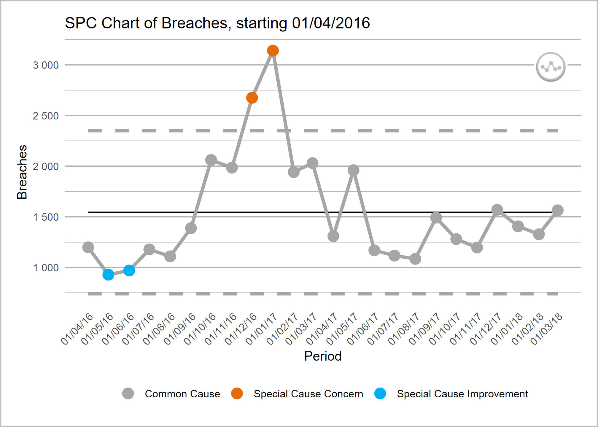
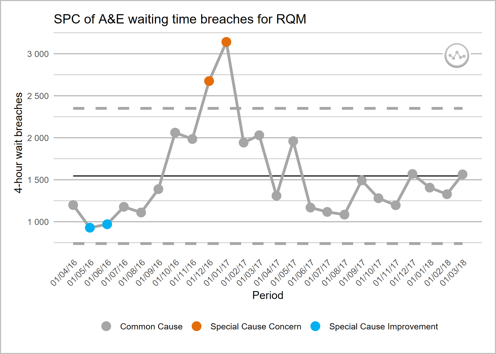

<!-- README.md is generated from README.Rmd. Please edit that file -->

# NHSRplotthedots <a alt="NHS-R Community's logo" href='https://nhsrcommunity.com/'></a>

<!-- badges: start -->

[](https://lifecycle.r-lib.org/articles/stages.html#stable)
[](https://github.com/nhs-r-community/NHSRplotthedots/actions)
[](https://app.codecov.io/gh/nhs-r-community/NHSRplotthedots?branch=main)
[](https://CRAN.R-project.org/package=NHSRplotthedots)
[](https://CRAN.R-project.org/package=NHSRplotthedots)
<!-- badges: end -->

This package is built by the [NHS-R
community](https://nhsrcommunity.com) to provide tools for drawing
statistical process control (SPC) charts. This package supports the
NHSE/I programme [‘Making Data
Count’](https://www.england.nhs.uk/publication/making-data-count/), and
allows users to draw XmR charts, use change points, and apply rules with
summary indicators for when rules are breached.

Please be aware that this package is in the early stages of development,
and features may change.

## Installation

``` r
# install from CRAN
install.packages("NHSRplotthedots")

# Or install the development version from GitHub using {remotes} package:
# install.packages("remotes")
remotes::install_github("https://github.com/nhs-r-community/NHSRplotthedots", build_vignettes = TRUE)
```

# Overview

Welcome to the NHS-R community’s package for building a specific type of
statistical process control (SPC) chart, the XmR chart. We are aiming to
support the NHS England and NHS Improvement’s ‘Making Data Count’
programme, please see [‘Making Data Count’
programme](https://www.england.nhs.uk/publication/making-data-count/)
for more details. The programme encourages boards, managers, and analyst
teams to present data in ways that show change over time, and drive
better understanding of indicators than ‘RAG’ (red, amber, green) rated
board reports often present.

The help-files, and vignette within this package tell you more about the
possible options for controlling the charts, but below is a simple
example of the type of chart the package produces. We will use the
`ae_attendances` dataset from the `{NHSRdatasets}` package and a bit of
`{dplyr}` code to select some organisations.

``` r
library(NHSRplotthedots)
library(NHSRdatasets)
library(tidyverse)

sub_set <- ae_attendances %>%
  filter(org_code == "RQM", type == 1, period < as.Date("2018-04-01"))

sub_set %>%
  ptd_spc(value_field = breaches, date_field = period, improvement_direction = "decrease")
```



This plot is ok on its own, but we can specify more control options
when we pass it on, using the `{dplyr}` pipe function below: `%>%` to
the plot argument.

``` r
sub_set %>%
  ptd_spc(value_field = breaches, date_field = period, improvement_direction = "decrease") %>%
  plot(
    y_axis_label = "4-hour wait breaches",
    main_title = "SPC of A&E waiting time breaches for RQM"
  )
```



or, equivalently:

``` r
sub_set %>%
  ptd_spc(value_field = breaches, date_field = period, improvement_direction = "decrease") %>%
  ptd_create_ggplot(
    y_axis_label = "4-hour wait breaches",
    main_title = "SPC of A&E waiting time breaches for RQM"
  )
```

## Getting help:

To find out more about the `ptd_spc()` function, you can view the help
with:

``` r
?ptd_spc
```

Details on the extra plot controls can be found using:

``` r
?ptd_create_ggplot
```

To view the vignette (worked example), use:

``` r
vignette("intro", package = "NHSRplotthedots")

vignette(package = "NHSRplotthedots")
```

# Contribution

This is an NHS-R Community project that is open for anyone to contribute
to in any way that they are able. The project is released with a
[Contributor Code of
Conduct](https://contributor-covenant.org/version/2/1/CODE_OF_CONDUCT.html).
By contributing to this project, you agree to abide by its terms.

If you want to learn more about this project, please join the discussion
at [the NHS-R Community Slack group](https://nhsrcommunity.slack.com/)
and the specific channel
[\#proj-nhsr-plot-the-dots](https://nhsrcommunity.slack.com/archives/CSVD4SYF3).

The simplest way to contribute is to raise an issue detailing the
feature or functionality you would like to see added, or any unexpected
behaviour or bugs you have experienced.
